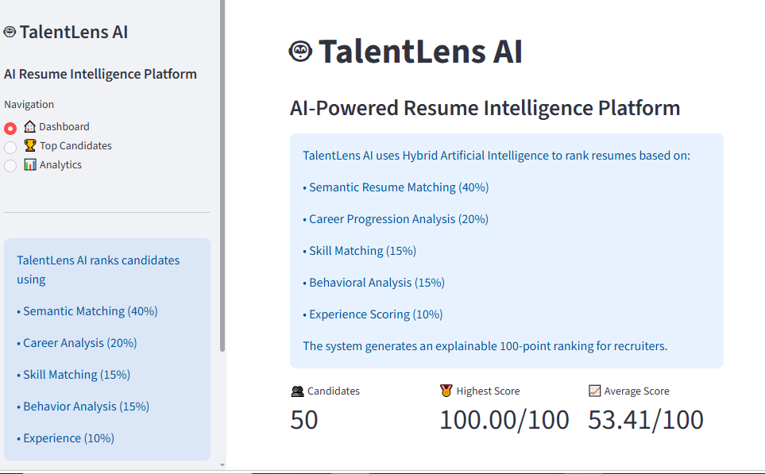
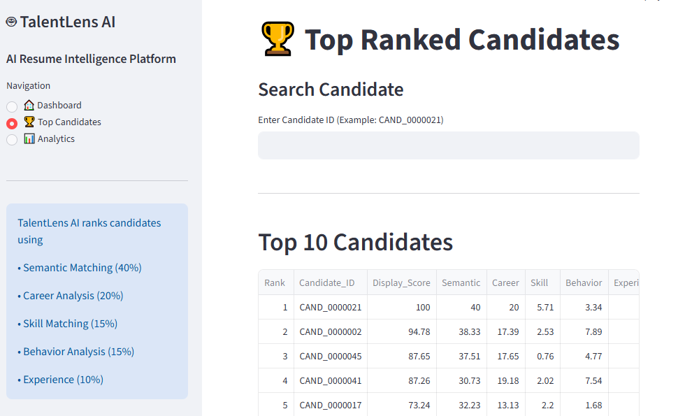
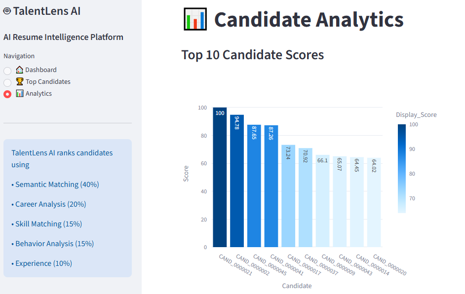

# 🤖 TalentLens AI


AI-Powered Resume Intelligence Platform that ranks candidates using semantic matching, career progression, skill analysis, behavioral scoring, and experience evaluation.

# 🚀 TalentLens-AI

> **AI-Powered Resume Intelligence Platform for Explainable Candidate Ranking**

TalentLens-AI is an AI-powered resume screening platform that helps recruiters identify the most suitable candidates by combining Natural Language Processing (NLP), semantic similarity, and explainable AI scoring.

Instead of relying only on keyword matching, TalentLens-AI evaluates resumes using multiple intelligent modules including semantic understanding, career progression, technical skills, behavioral analysis, and professional experience to generate a transparent **100-point candidate score**.

--
# 🚀 TalentLens-AI

> **AI-Powered Resume Intelligence Platform for Explainable Candidate Ranking**

[](https://talentlens-ai-souvik.streamlit.app/)
[](https://github.com/souvikpal77/TalentLens-AI)

TalentLens-AI is an AI-powered resume screening platform...

---

## 📸 Dashboard Preview

### Dashboard



### Top Candidates



### Analytics



## 🌟 Key Features

- 🤖 Semantic Resume Matching using Sentence Transformers
- 📈 Career Progression Analysis
- 🛠 Skill Matching Engine
- 🧠 Behavioral Analysis
- 💼 Experience Evaluation
- 📊 Explainable 100-Point AI Scoring
- 🏆 Intelligent Candidate Ranking
- 📋 Interactive Streamlit Dashboard
- 📥 CSV Export for Recruiters

---

# 🎯 Why TalentLens-AI?

Traditional resume screening is manual, time-consuming, and often biased toward keyword matching.

TalentLens-AI introduces an explainable AI-based ranking framework that evaluates candidates from multiple perspectives rather than relying solely on resume keywords.

The platform intelligently combines:

- 🔍 Semantic Resume Matching
- 💼 Career Progression Analysis
- 🛠 Technical Skill Matching
- 🧠 Behavioral Assessment
- 📈 Experience Evaluation

These independent AI modules are combined using a weighted scoring engine to generate an explainable **100-point ranking**, helping recruiters make faster and more informed hiring decisions.

---

# 🏛 System Architecture

```
                   Job Description
                          │
                          ▼
                  Candidate Resumes
                          │
                          ▼
               Resume Processing Engine
                          │
                          ▼
 ┌───────────────────────────────────────────────────────┐
 │                                                       │
 │  Semantic Matching                                    │
 │  Career Progression Analysis                          │
 │  Skill Matching                                       │
 │  Behavioral Analysis                                  │
 │  Experience Evaluation                                │
 │                                                       │
 └───────────────────────────────────────────────────────┘
                          │
                          ▼
              Weighted AI Scoring Engine
                          │
                          ▼
             Explainable 100-Point Score
                          │
                          ▼
             Candidate Ranking & Sorting
                          │
               ┌──────────┴──────────┐
               ▼                     ▼
      Streamlit Dashboard      CSV Export
```

---

# 🏆 AI Scoring Framework

Each candidate is evaluated using five AI-powered scoring modules.

| Component | Weight |
|-----------|--------|
| Semantic Matching | **40%** |
| Career Progression | **20%** |
| Skill Matching | **15%** |
| Behavioral Analysis | **15%** |
| Experience Analysis | **10%** |

**Final Candidate Score = 100 Points**

---

# 📂 Project Structure

```
TalentLens-AI
│
├── data/
├── docs/
├── outputs/
├── src/
├── tests/
│
├── app.py
├── rank.py
├── requirements.txt
├── README.md
└── .gitignore
```

---

# ⚙️ Technology Stack

### Programming

- Python

### Artificial Intelligence

- Sentence Transformers
- Hugging Face Transformers
- NLP

### Data Processing

- Pandas
- NumPy
- Scikit-learn

### Frontend

- Streamlit

### Version Control

- Git
- GitHub

---

# 🚀 Installation

Clone the repository

```bash
git clone https://github.com/souvikpal77/TalentLens-AI.git
```

Move into the project folder

```bash
cd TalentLens-AI
```

Install dependencies

```bash
pip install -r requirements.txt
```

Launch the application

```bash
streamlit run app.py
```

---

# 📊 Sample Ranking Output

| Rank | Candidate ID | AI Score |
|------|--------------|----------|
| 🥇 1 | CAND_0000021 | 100.00 |
| 🥈 2 | CAND_0000002 | 94.78 |
| 🥉 3 | CAND_0000045 | 87.65 |
| 4 | CAND_0000041 | 87.26 |
| 5 | CAND_0000017 | 73.24 |

---

# 🔄 Project Workflow

1. Load Job Description
2. Load Candidate Resumes
3. Resume Preprocessing
4. Semantic Similarity Analysis
5. Skill Matching
6. Career Progression Analysis
7. Behavioral Scoring
8. Experience Evaluation
9. Weighted AI Scoring
10. Candidate Ranking
11. Dashboard Visualization
12. CSV Report Generation

---

# 💡 Future Enhancements

- 📄 PDF Resume Parsing
- 🖼 OCR-Based Resume Extraction
- 🤖 LLM-Powered Resume Feedback
- 🎯 Interview Recommendation Engine
- 📊 Recruiter Analytics Dashboard
- ☁ Cloud Deployment
- 🔗 REST API Support
- 🌐 Multi-language Resume Support

---

# 📌 Dataset

The original **candidates.jsonl** dataset is excluded from this repository because it exceeds GitHub's file size limit.

The repository includes sample data required to demonstrate the complete workflow.

---

# 👨‍💻 Developer

## **Souvik Pal**

**Artificial Intelligence • Machine Learning • NLP • Python Developer**

GitHub:
**https://github.com/souvikpal77**

---

# 📜 License

This project is developed for educational, research, and hackathon purposes.

---

# ⭐ Support

If you found this project useful, consider giving this repository a ⭐ on GitHub.

It motivates future development and improvements.